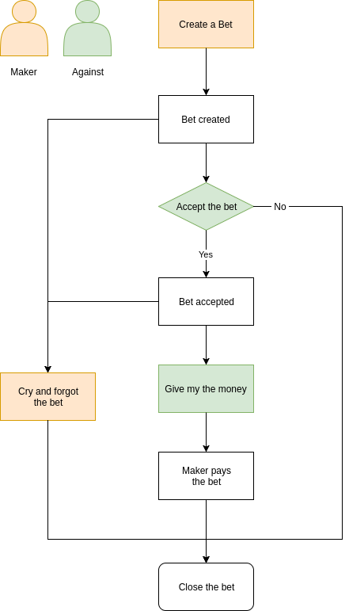

# BetsToken

The BetsToken smart contract (written with **Solidity** to work on **Ethereum**) create a Token and is able to create new bets* using the BetsToken. The token should be initialised with the information that any other **ERC20** token needs (name, symbol, total supply and # of decimals).

***Note:** is an stupid bet system, where the maker of the bet is not able to win the bet. That's part of a joke but it's totally functional and can be improved (a possible solution is use a 3rd people to judge if has been won/lose the bet).

## How the smart contract works

### Drip system

Any user is able to participate on the bet token for free. So it's able to execute the function `dripToMe` that gives 1 token. This token comes from the address that initialise the token (token owner), and only works if the owner has more than 50% of the tokens.

### Bets

Any user can open a new bet (if has not tokens, can claim it before). If the user open a bet, won't be able to win the bet, but can retire the bet (using the function `cryAndForgotBet`). The bet taker can accept or reject the bet with  `acceptBet` function (it will immobilise the amount of the value) and then the taker can ask for the money with the function `giveMeTheMoney`, if is not executed this function, the bettor is able to retire the bet.

  

## Development

### Development server

Run `npm start` for run a dev server. Navigate to `http://localhost:4200/`. The app will automatically reload if you change any of the source files.

### Build

Run `npm run build` to build the project. The build artifacts will be stored in the `dist/` directory.

### Running unit tests

Run `npm test` to execute the unit tests.
Run `npm run test:watch` to execute the units tests and watch changes.
